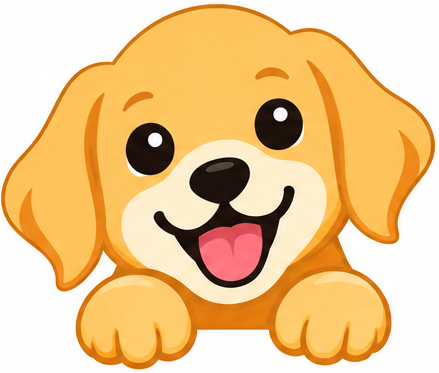

<h1>
  
  MiniDog
</h1>

MiniDog is a teaching resource for flow-matching generative models. It has two tasks.

- **Task 1**: learn flow-matching basics on 2D toy data. Runs on CPU in `toy_flow_matching.ipynb`, ~15 minutes.
- **Task 2**: pretrain and fine-tune a text-to-image diffusion transformer on dog photos. Runs on 4 consumer GPUs from the `minidog/` package, ~3 hours.

Both tasks train the same objective:

- A network learns the velocity that moves noise to data along a straight line.
- Sampling integrates that velocity.
- Task 1 shows this on 2D points you can plot.
- Task 2 runs it at full scale: a LightningDiT on VAE latents, with text conditioning, REPA, classifier-free guidance, and FID and preference scores.

**Prerequisites**: linear algebra, probability, and basic PyTorch. You should be able to write an `nn.Module`
and a training loop.

## Where each concept lives

| Concept | Task 1 (`toy_flow_matching.ipynb`) | Task 2 (`minidog/`) |
|---|---|---|
| Forward process `x_t = (1-t) x + t eps` | `FlowMatching.training_losses` | `transport.py`: `Transport.sample` |
| Loss on the velocity `v = eps - x` | same cell | `transport.py`: `Transport.compute_loss` |
| x- vs v-prediction | `pred_type` branches | `transport.py`: `convert_model_pred`; config `transport.prediction` |
| Euler sampling, noise to data | `FlowMatching.sample` | `transport.py`: `Sampler.sample_ode` |
| Time conditioning | `SinusoidalEmbedding` | `dit.py`: `GaussianFourierEmbedding`, 4 learned time tokens |
| The denoiser | `MLPDenoiser` | `dit.py`: `LightningDiT` (patch embed, RoPE, attention blocks, SwiGLU) |
| Text conditioning | — | `text_encoder.py` (Qwen3-0.6B); `dit.py`: `ConditionEmbedder` |
| Classifier-free guidance | — | `transport.py`: `apply_cfg_dropout` (train), `forward_with_cfg` (sample) |
| Latent space | orthogonal projection to `D` dims | `vae.py` (frozen E2E-INVAE); `precompute_latents.py` |
| REPA alignment | — | `dinov2.py` (target); `dit.py`: `repa_projector`; loss in `Transport.training_losses` |
| Training loop, EMA | *Training loop* cell | `engine.py`: `train_one_epoch`; `utils/train_utils.update_ema` |
| Evaluation | look at the samples | `eval.py` (FID, IS); `score.py` (PickScore, HPSv2) |
| Experiments | Experiments 1 and 2 | `configs/`, see [`configs/README.md`](configs/README.md) |

## Getting started

**Task 1: flow-matching basics** (CPU, ~15 minutes)

```bash
uv sync
uv run jupyter lab toy_flow_matching.ipynb
```

Run the notebook top to bottom. Each cell is explained in the markdown above it. You will learn:

- how a flow-matching model is trained and sampled;
- why predicting the clean data beats predicting the velocity when the data lives in a high-dimensional space.

**Task 2: MiniDog text-to-image** (4 GPUs, ~3 hours)

Follow [`minidog/README.md`](minidog/README.md). It walks through six steps: download the data,
precompute latents, pretrain, fine-tune, generate, score. You will learn:

- how a text-to-image diffusion transformer is built and trained with the same objective;
- how the tokenizer, REPA and guidance change the result;
- why FID and human-preference scores disagree after fine-tuning.

## Going further

- Set `transport.prediction` to `x` and compare FID curves: the Task 1 question at full scale.
- Turn `repa.use_repa` off, or change `repa.repa_layer_depth`.
- Swap the tokenizer with `stage_1.params.vae_type`: `e2e-invae` or `e2e-vavae`.
- Sweep `guidance.cfg.scale` on a checkpoint with `minidog.offline_eval`.
- Fine-tune on your own images: pack `jpg` + `txt` WebDataset shards, precompute with `sft.yaml`, train from the pretrain checkpoint.

## Layout

```
toy_flow_matching.ipynb   Task 1
minidog/                  Task 2 package and README
configs/                  experiment configs and results
```
